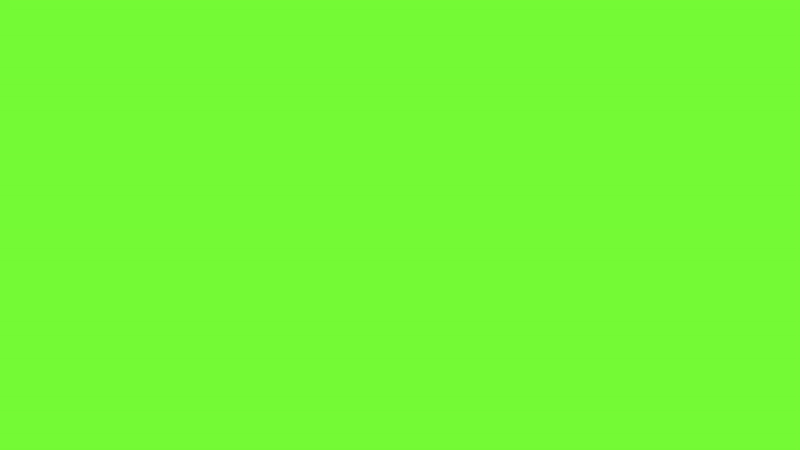

### a0001_color_circles

Breve descripción
- Animación en p5.js que genera circulos con colores aleatorios y los va borrando.

Demostración

### a0002_background_color_change

Breve descripción
- Animación en p5.js que cambia dinámicamente el color de fondo.

Demostración

